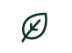
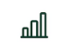
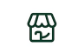
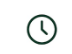
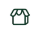

<p align="center">
  
</p>

<p align="center">
  <strong>Una segunda oportunidad para cada alimento.</strong>
</p>

<p align="center">


</p>

---

##  ¿Qué es Lüp?

Lüp es una plataforma inteligente que conecta comercios, consumidores y organizaciones para reducir el desperdicio alimentario mediante la venta con descuento y la gestión responsable de excedentes.

Nuestro objetivo es transformar alimentos próximos a vencer en oportunidades, generando un impacto **ambiental**, **social** y **económico**.

---

##  Objetivos

- Reducir el desperdicio alimentario.
- Promover la economía circular.
- Disminuir pérdidas económicas en comercios.
- Facilitar el acceso a alimentos a menor costo.
- Impulsar donaciones responsables.
- Incorporar Inteligencia Artificial para optimizar la gestión de excedentes.

---

##  Funcionalidades

### Comercios

- Publicación de excedentes.
- Descuentos inteligentes.
- Gestión de stock.
- Estadísticas de impacto.

### Consumidores

- Productos cercanos con descuento.
- Reserva desde la aplicación.
- Historial de compras.

### Organizaciones

- Gestión de donaciones.
- Solicitud de alimentos.

### Inteligencia Artificial

- Reconocimiento de productos.
- Carga automática de información.
- Recomendación de descuentos.
- Indicadores ambientales.

---

##  Impacto

| Ambiental | Social | Económico |
|-----------|--------|-----------|
| 🌿 Menos desperdicio | 🤝 Mayor acceso a alimentos | 💰 Menores pérdidas |
| ♻️ Economía circular | ❤️ Apoyo a organizaciones | 📦 Mejor aprovechamiento |
| 🌎 Reducción de residuos | 👥 Consumo responsable | 📈 Optimización del stock |

---

##  Tecnologías

- Python
- Django
- HTML
- CSS
- JavaScript
- Bootstrap
- SQLite / PostgreSQL
- Git & GitHub
- Inteligencia Artificial

---

##  Estructura

```text
LUP/
│
├── assets/
│   ├── branding/
│   ├── logo/
│   ├── icons/
│   └── mockups/
│
├── backend/
├── frontend/
├── docs/
├── hardware/
│
├── README.md
└── .gitignore
```

---

<p align="center">

**Más valor. Menos desperdicio.**

</p>