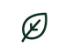
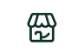
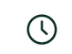
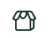
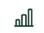

<p align="center">

  

</p>

<p align="center">

  <strong>Una segunda oportunidad para cada alimento.</strong>

</p>

<p align="center">


</p>

---

##  ¿Qué es Lüp?

Lüp es una plataforma inteligente que conecta comercios, consumidores y organizaciones para reducir el desperdicio alimentario mediante la venta con descuento y la gestión responsable de excedentes.

Nuestro objetivo es transformar alimentos próximos a vencer en oportunidades, generando un impacto **ambiental**, **social** y **económico**.

---

##  Objetivos

- Reducir el desperdicio alimentario.
- Promover la economía circular.
- Disminuir pérdidas económicas en comercios.
- Facilitar el acceso a alimentos a menor costo.
- Impulsar donaciones responsables.
- Incorporar Inteligencia Artificial para optimizar la gestión de excedentes.

---

##  Funcionalidades

### Comercios

- Publicación de excedentes.
- Descuentos inteligentes.
- Gestión de stock.
- Estadísticas de impacto.

### Consumidores

- Productos cercanos con descuento.
- Reserva desde la aplicación.
- Historial de compras.

### Organizaciones

- Gestión de donaciones.
- Solicitud de alimentos.

### Inteligencia Artificial

- Reconocimiento de productos.
- Carga automática de información.
- Recomendación de descuentos.
- Indicadores ambientales.

---

##  Impacto

| Ambiental | Social | Económico |
|-----------|--------|-----------|
| 🌿 Menos desperdicio | 🤝 Mayor acceso a alimentos | 💰 Menores pérdidas |
| ♻️ Economía circular | ❤️ Apoyo a organizaciones | 📦 Mejor aprovechamiento |
| 🌎 Reducción de residuos | 👥 Consumo responsable | 📈 Optimización del stock |

---

##  Tecnologías

- Python
- Django
- HTML
- CSS
- JavaScript
- Bootstrap
- SQLite / PostgreSQL
- Git & GitHub
- Inteligencia Artificial

---

##  Estructura

```text

LUP/
├── .gitignore
├── README.md
├── requirements.txt
├── manage.py
│
├── scr/                          <-- 🌐 CÓDIGO FUENTE DE LA PÁGINA WEB 
│   ├── bd_lup/                   <-- Aplicaciones internas 
│   └── lup/                      <-- Configuración principal de Django 
│
├── app/                          <-- 📱 CÓDIGO FUENTE DE LA APP MÓVIL (React Native / Expo / Flutter)
│   ├── src/
│   ├── assets/
│   └── App.js
│
├── doc/                          <-- 📄 DOCUMENTACIÓN Y RECURSOS DEL PROYECTO
│   ├── diseno/                   <-- Wireframes, Figma, paleta de colores, maquetas
│   ├── comercio/                 <-- Requerimientos de comercios, minutas de reuniones, PDFs
│   ├── legal/                    <-- Términos y condiciones, contratos, alianzas
│   └── manuales/                 <-- Manuales de usuario, guías de instalación
│
└── jpg/                          <-- 🖼️ IMÁGENES Y RECURSOS GRÁFICOS
    ├── doc_assets/               <-- Capturas o fotos usadas en la documentación (ej. del README)
    ├── productos/                <-- Fotos de prueba de productos/ofertas
    ├── comercios/                <-- Logos/fotos de prueba de los comercios
    └── marcas/                   <-- Logos oficiales de LÜP (isotipo, imagotipo, favicon)
---

##  Estado Técnico Actual

Actualmente el proyecto cuenta con la estructura backend base en Django:

- **Autenticación y Usuarios:** configuración del modelo de usuario personalizado (`Usuario`) con soporte para roles diferenciados, principalmente **Consumidor** y **Comercio**.
- **Gestión de Comercios:** formularios y modelos de base de datos (`models.py`) configurados para registrar datos específicos del local, como CUIT, dirección, rubro y horarios de atención.
- **Arquitectura Base:** estructura general vinculada a SQLite/PostgreSQL y configuración global en `settings.py`.
- **Estado del Proyecto:** el proyecto se encuentra actualmente **en desarrollo**, con la estructura backend inicial implementada y funcionalidades adicionales en proceso de desarrollo.

---


<p align="center">

**Más valor. Menos desperdicio.**

</p>

